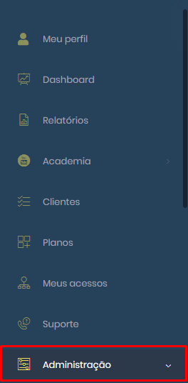

# Como criar um usuário DevOps

Primeiro vamos na aba principal e clicamos em administração

<figure><figcaption></figcaption></figure>

vamos na aba usuários.

<figure><figcaption></figcaption></figure>

clicamos em "criar novo usuário".

<figure><figcaption></figcaption></figure>

e por fim criamos com as suas informações juntamente com as suas permissões.

&#x20;

<figure><figcaption></figcaption></figure>

Encaminhar um email da seguinte maneira:\
\
"Bom dia xxx.

&#x20;

Acesso liberado ao cliente xxx, você vai receber um e-mail de ativação, por favor clicar no link sem estar logado na plataforma.

&#x20;

Qualquer dúvida por favor me informar.

&#x20;

Obrigado."
