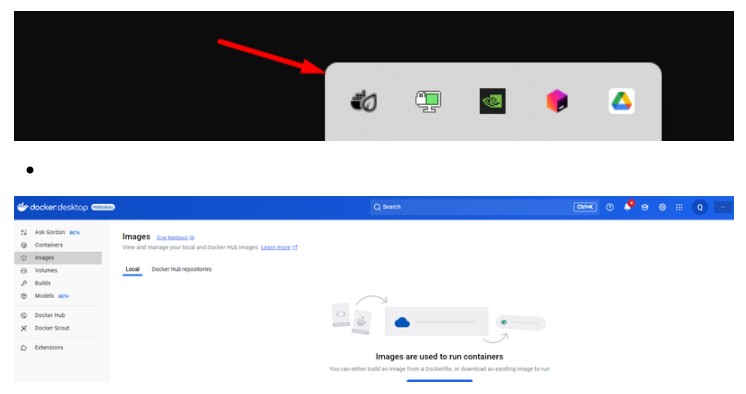
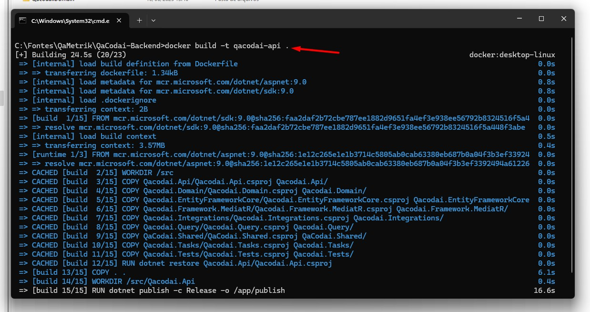

# Gerando Imagens e Salvando DockerHub

## Instalação do Docker Desktop

* Link: [https://www.docker.com/get-started/](https://www.docker.com/get-started/)
* Efetuado o download e instalação da versão para Windows

## Efetuar Login no Docker Hub

* Link: [https://hub.docker.com](https://hub.docker.com/repositories/qametrik)
* Email: eraldo.filho@qametrik.com
* Senha: QaMetrik2025#

## Acessar cmd e efetuar login no DockerHub

* Necessário está com Docker rodando para utilizar os comandos do Docker no cmd

<figure><figcaption></figcaption></figure>

* Abrir cmd e digitar o comando: docker login
* Será solicitado a validação no browser para sincronização da conta
* Caso seja solicitado inserir usuário e senha da conta do DockerHub
* **Usuario**: qametrik **Senha**: QaMetrik2025#

## Gerando Imagens

* Acessar a raiz do projeto via cmd
* Rodar o comando para criar a imagem docker

**Projeto QaCodai-API**:

1. docker build -t qacodai-api
2. docker tag qacodai-api qametrik/qacodai-api:latest
3. docker push qametrik/qacodai-api:latest

**Projeto QaCodai-UI**:

1. docker build -t qacodai-ui
2. docker tag qacodai-uiqametrik/qacodai-ui:latest
3. docker push qametrik/qacodai-ui:latest

**Projeto QaPayments-API**:

1. docker build -t qapayments-api
2. docker tag qapayments-api qametrik/qapayments-api:latest
3. docker push qametrik/qapayments-api:latest

<figure><figcaption></figcaption></figure>

* Após criar a imagem e rodar os comandos a imagem será enviada para o repositório DockerHub da qametrik
