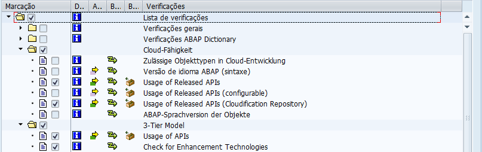

# Configuração de verificação de código (SCI)

Criar uma variante na transação **SCI**, baseada no modelo **Z005** do ambiente S/4HANA de referência.\
Ajustar os parâmetros conforme as diretrizes de Clean Core, assegurando a validação adequada dos desenvolvimentos customizados.

<figure><figcaption></figcaption></figure>

<figure><figcaption></figcaption></figure>

<figure><figcaption></figcaption></figure>
