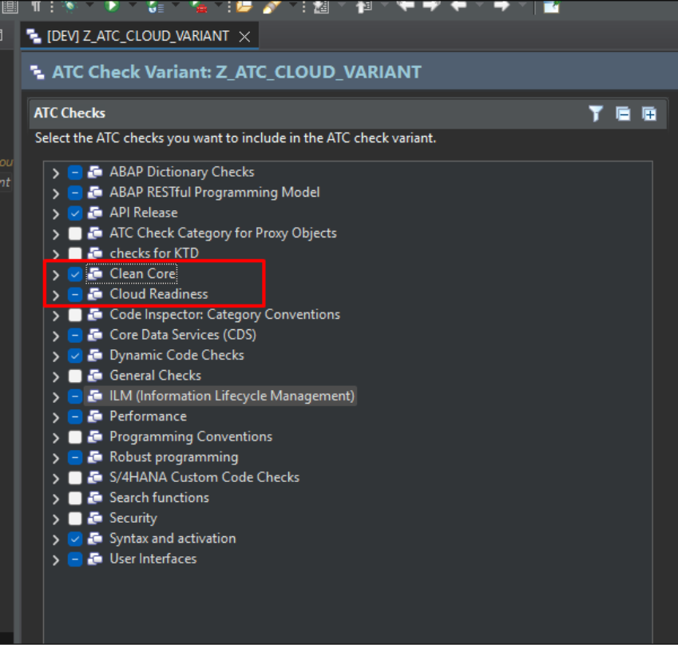

# Passos para Ativação dos itens Clean Core em ambientes SAP S/4HANA 2023 private cloud e on-premise

Aplicação da nota [3565942 - Verificações ATC "Utilização de APIs" e "Tecnologias de ampliação permitidas" - SAP for Me](https://me.sap.com/notes/3565942) e demais dependências.

Passos manuais via ADT:&#x20;

* Criar e ativar categoria de validação Clean Core(ATC Check Category), no ATC: &#x20;

Utilizar o pacote SYCM\_ANALYSIS\_CC.&#x20;

Nome: SYCM\_3TIER.&#x20;

Descrição: Clean Core.&#x20;

&#x20;

* Criar e ativar validações ATC(ATC Check):&#x20;

Nome: SYCM\_USAGE\_OF\_APIS&#x20;

Descrição: Usage of APIS&#x20;

Categoria: SYCM\_3TIER&#x20;

Classe implementadora: CL\_YCM\_CC\_CHECK\_API\_USAGE&#x20;

&#x20;

Nome: SYCM\_ALLOWED\_ENH\_TECHNOLOGY&#x20;

Descrição: Allowed Enhancement Technologies&#x20;

Categoria: SYCM\_3TIER&#x20;

Classe implementadora: CL\_CI\_TEST\_ADMISSIBLE\_ENHANCM&#x20;

&#x20;

* Criar nova variante de validação com cópia da ABAP\_CLOUD\_DEVELOPMENT\_DEFAULT e ativar as opções para Clean Core.&#x20;

&#x20;

<figure><figcaption></figcaption></figure>

&#x20;

Para a opção Usage of APIs, utilizar o link url(https://raw.githubusercontent.com/SAP/abap-atc-cr-cv-s4hc/refs/heads/main/src/objectClassifications\_3TierModel.json) no parâmetro classicAPIDataSource&#x20;

&#x20;

<figure><figcaption></figcaption></figure>

Para a opção Usage of Released APIs, utilizar a url [https://raw.githubusercontent.com/SAP/abap-atc-cr-cv-s4hc/main/src/objectClassifications.json](https://raw.githubusercontent.com/SAP/abap-atc-cr-cv-s4hc/main/src/objectClassifications.json) no parâmetro URLObjectClassifications&#x20;

&#x20;\
&#x20;

<figure><figcaption></figcaption></figure>

Para a opção Usage of Release APIs (Cloudification), utilizar a url [https://raw.githubusercontent.com/SAP/abap-atc-cr-cv-s4hc/main/src/objectReleaseInfoLatest.json](https://raw.githubusercontent.com/SAP/abap-atc-cr-cv-s4hc/main/src/objectReleaseInfoLatest.json) no parâmetro Url e a url [https://raw.githubusercontent.com/SAP/abap-atc-cr-cv-s4hc/main/src/objectClassifications.json](https://raw.githubusercontent.com/SAP/abap-atc-cr-cv-s4hc/main/src/objectClassifications.json) no parâmetro URLObjectClassifications

<figure><figcaption></figcaption></figure>

Caso gere erro abaixo, ao selecionar as novas avaliações do Clean Core, não vai ser possível configurar corretamente os parâmetros.&#x20;

&#x20;

<figure><figcaption></figcaption></figure>

Para corrigir este erro, fazer os seguintes passos:&#x20;

Via ADT, abrir os objetos SYCM\_CLOUD\_RELEASED\_OBJECTS e SYCM\_RELEASED\_CLOUDIFIC\_REPOS, e clicar em Import Parameters.&#x20;

&#x20;

<figure><figcaption></figcaption></figure>

&#x20;

<figure><figcaption></figcaption></figure>

Após este passo, entrar no ambiente Gui, ir na transação SCI, no menu Utilitários -> Importar variantes de verificação.&#x20;

&#x20;

<figure><figcaption></figcaption></figure>

&#x20;

Após estes passos, voltar na Variante nova criada e configurar os parâmetros com as URLs informadas acima.&#x20;

&#x20;

OBS.: Caso o ambiente ainda não possua, deve-se instalar o certificado do GitHub.&#x20;

&#x20;

Para obter o certificado, entrar no link [https://docs.github.com/pt](https://docs.github.com/pt) e seguir os passos abaixo:&#x20;

&#x20;

<figure><figcaption></figcaption></figure>

&#x20;

<figure><figcaption></figcaption></figure>

&#x20;

<figure><figcaption></figcaption></figure>

Na janela que abrirá, ir na aba Detalhes e no botão Exportar&#x20;

&#x20;

<figure><figcaption></figcaption></figure>
