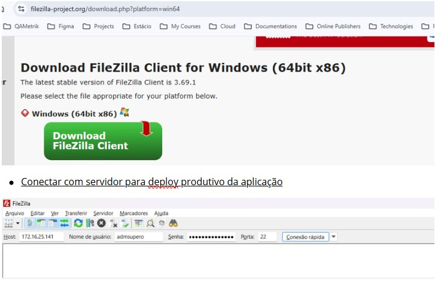
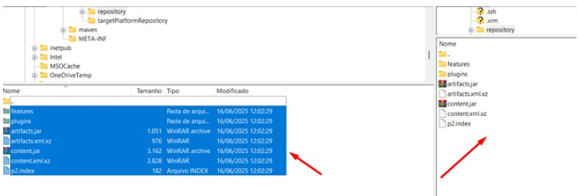

# Instalação FileZilla

* Efetuar o download do FileZilla para efetuar conexão FTP com servidor\
  [https://filezilla-project.org/download.php?platform=win64](https://filezilla-project.org/download.php?platform=win64)

<figure><figcaption></figcaption></figure>

* Ao conectar com o servidor acessar a pasta repository em: **/home/admsupero/repository** e efetuar a substituição dos arquivos pelos arquivos contidos no ambiente local em: **QaPlugin-Java\com.qametrik.qacodai.updatesite\target\repository**

<figure><figcaption></figcaption></figure>

* Após finalizado os passos projeto estará atualizado e usuário poderá efetuar o update via Java Eclipse

