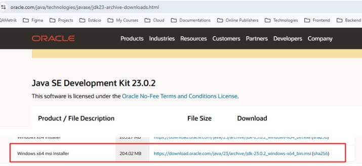
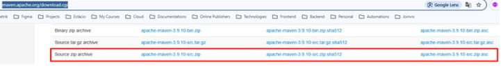

# Instalações

## Repositório Projeto

* Baixar repositório do projeto em



## Instalação de SDK Java

* Criar diretório apps em **C:\apps**
* Dentro da pasta **C:\apps** criar diretório **C:\apps\jdk-23.0.2**
* Baixar SDK 23.0.2 Java versão **Windows x64 msi Installer** em:



<figure><figcaption></figcaption></figure>

* Após download do arquivo abrir instalador e instalar em **C:\apps\jdk-23.0.2**

## Instalação Apache Maven

* Baixar Zip Apache Maven versão 3.9.10 em: [https://maven.apache.org/download.cgi](https://maven.apache.org/download.cgi)
* Dentro da pasta **C:\apps** criar diretório **C:\apps\apache-maven-3.9.10**
* Extrair conteúdo zip para o diretório **C:\apps\apache-maven-3.9.10**

<figure><figcaption></figcaption></figure>
