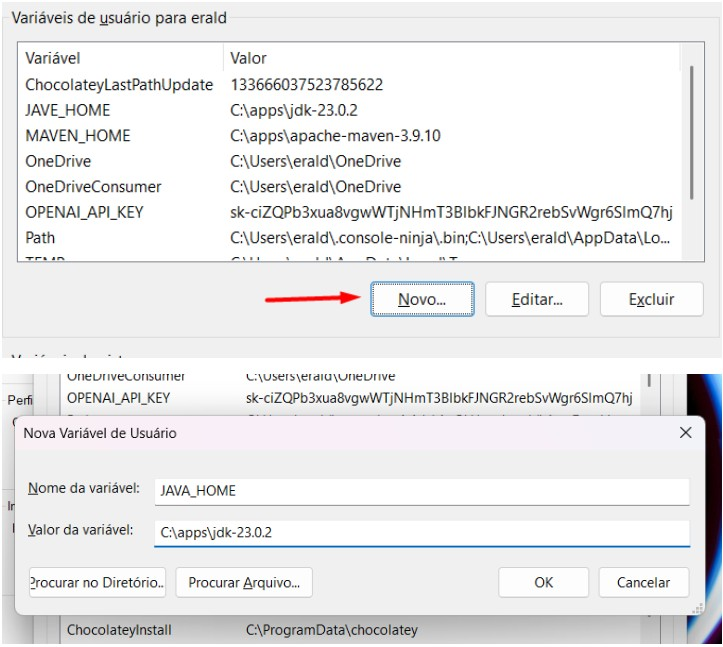
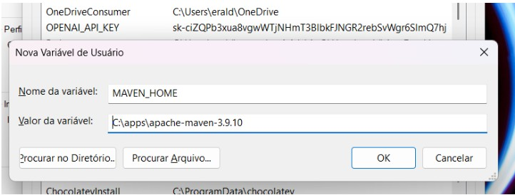
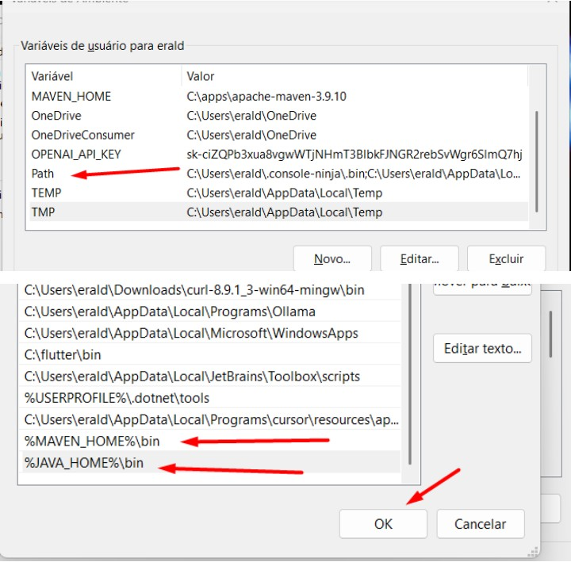

# Variáveis de Ambiente

## Criar variáveis de ambiente JAVA\_HOME e MAVEN\_HOME

<figure><figcaption></figcaption></figure>

<figure><figcaption></figcaption></figure>

## Adicionar variáveis no Path

* Efetuar dois cliques em Path
* Adicionar os valores **%MAVEN\_HOME%\bin** e **%JAVA\_HOME%\bin** e clicar em OK

<figure><figcaption></figcaption></figure>
