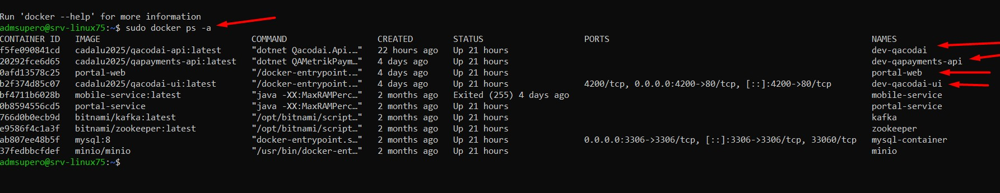
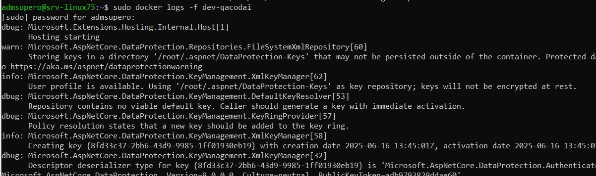

# Comandos Docker

## Visualizar containers criados e ativos

sudo docker ps -a

<figure><figcaption></figcaption></figure>

## Visualizar logs do container

sudo docker logs -f dev-qacodai

<figure><figcaption></figcaption></figure>

## Remover Imagem Docker

sudo docker rmi dev-qacodai

## Baixar Imagens Docker

sudo docker pull qametrik/qacodai-api:latest

sudo docker pull qametrik/qapayments-api:latest

sudo docker pull qametrik/qacodai-ui:latest

## Cria Containers e roda as imagens com as configurações do Container Portal-Web

sudo docker run -d --name dev-qacodai --restart unless-stopped --network host -p 8052:44357 qametrik/qacodai-api:latest

sudo docker run -d --name dev-qapayments-api --restart unless-stopped --network -p 8055:44355 host qametrik/qapayments-api:latest

sudo docker run -d --name dev-qacodai-ui -p 4200:80 --restart unless-stopped qametrik/qacodai-ui:latest
